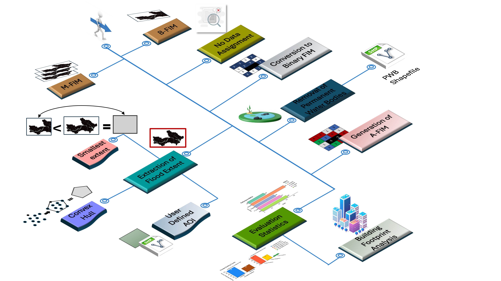
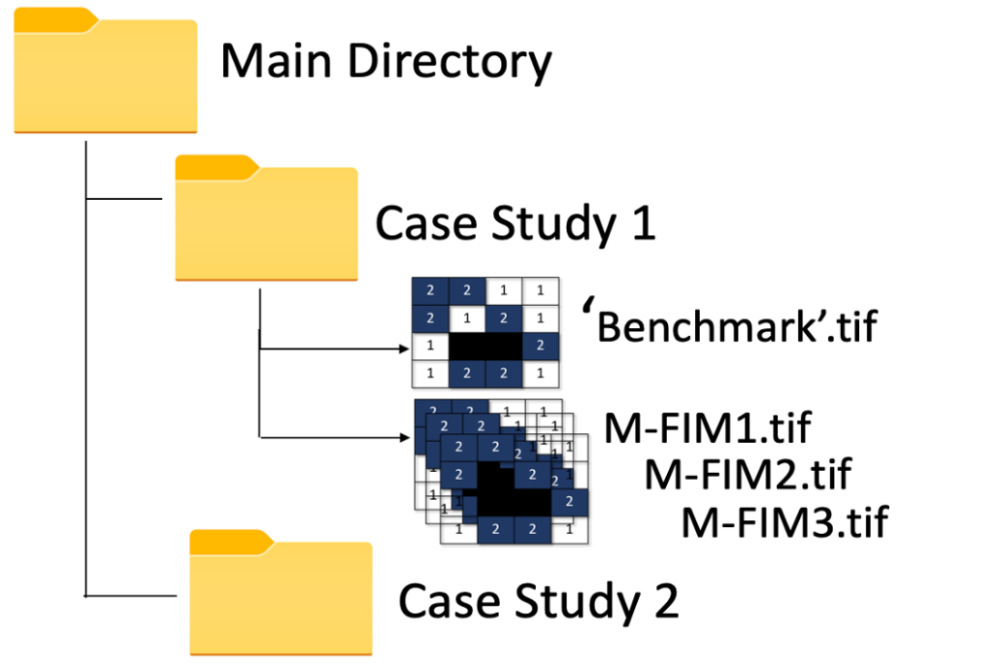
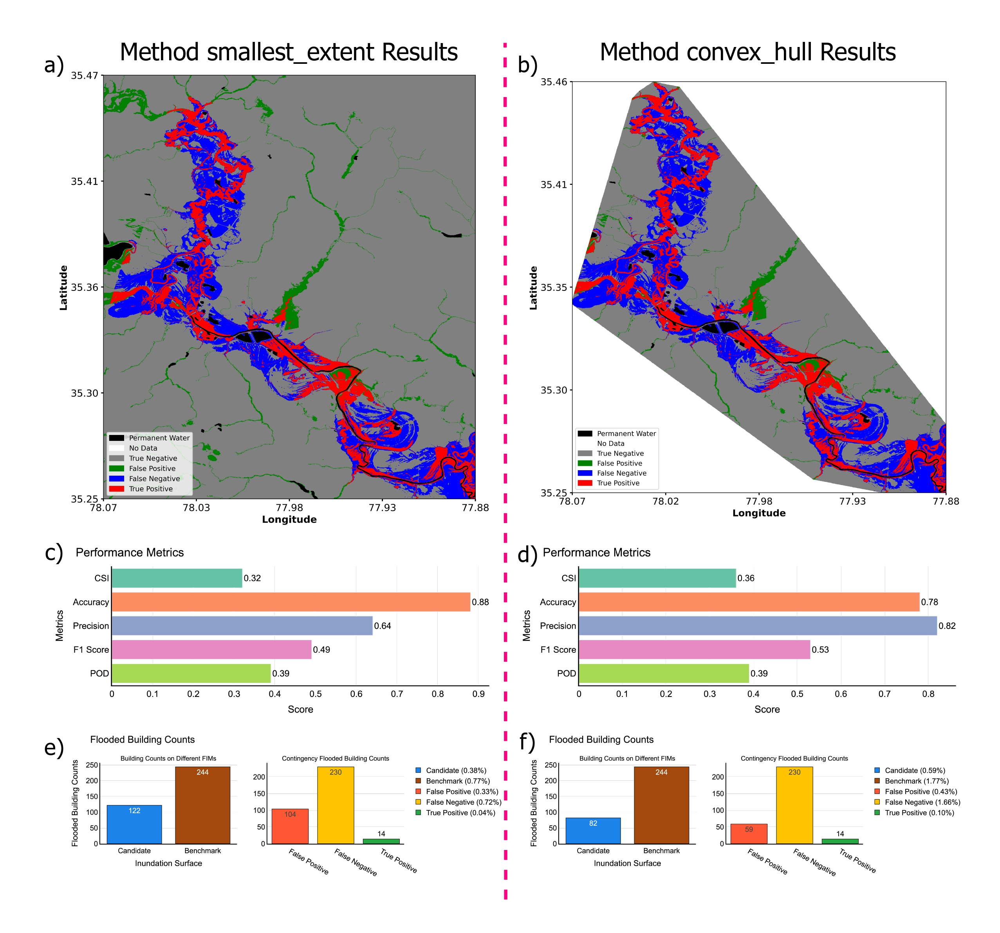

## Flood Inundation Mapping Predictions Evaluation Framework (FIMeval)
<hr style="border: 1px solid black; margin: 0;">  

[](https://github.com/sdmlua/fimeval/releases)
[](https://github.com/sdmlua/fimeval/issues)
[](https://opensource.org/licenses/GPL-3.0)
[](https://badge.fury.io/py/fimeval)
[](https://pepy.tech/projects/fimeval)

| | |
| --- | --- |
| <a href="https://sdml.ua.edu"></a> | This repository provides a user-friendly Python package and source code for the automatic evaluation of flood inundation maps. It is developed under Surface Dynamics Modeling Lab (SDML), Department of Geography and the Environment at The University of Alabama, United States.
 

### **Background**
<hr style="border: 1px solid black; margin: 0;">  

The accuracy of the flood inundation mapping (FIM) is critical for model development and disaster preparedness. The evaluation of flood maps from different sources using geospatial platforms can be tedious and requires repeated processing and analysis for each map. These preprocessing steps include extracting the correct flood extent, assigning the same projection system to all the maps, categorizing the maps as binary flood maps, removal of permanent water bodies, etc. This manual data processing is cumbersome and prone to human error.

To address these issues, we developed Flood Inundation Mapping Prediction Evaluation Framework (FIMeval), a Python-based FIM evaluation framework capable of automatically evaluating flood maps from different sources. FIMeval takes the advantage of comparing multiple target datasets with large benchmark datasets. It includes an option to incorporate permanent waterbodies as non-flood pixels with a user input file or pre-set dataset. In addition to traditional evaluation metrics, it can also compare the number of buildings inundated using a user input file or a pre-set dataset.


### **Repository structure**
<hr style="border: 1px solid black; margin: 0;">  

The architecture of the ```fimeval``` integrates different modules to which helps the automation of flood evaluation. All those modules codes are in source (```src``` ) folder.
```bash
fimeval/     
├── docs/                       # Documentation (contains 'FIMserv' Tool usage sample codes)
│   └── sampledata/              # Contains the sample data to demonstrate how this frameworks works    
│   └── fimeval_usage.ipynb            #Sample code usage of the Evaluation framework
├── Images/                       # have sample images for documentation       
├── src/
│   └── fimeval/         
│       ├──BuildingFootprint/ # Contains the evaluation of model predicted FIM with microsoft building footprint
│       │   └── evaluationwithBF.py       
│       └── ContingencyMap/      # Contains all the metrics calculation and contingency map generation
│       │   ├── evaluationFIM.py # main evaluation moodule 
│       │   └── methods.py  # Contains 3 different methods of evaluation 
│       │   └── metrics.py  # metrics calculation module
│       │   └── plotevaluationmetrics.py  # use to vizualize the different performance metrics
│       │   └── printcontingency.py  # prints the contingency map to quickly generate the Map layout
│       │   └── PWBs3.py  # module which helps to get permanent water bodies from s3 bucket
│       └── utilis.py   #Includes the resampling and reprojection of FIMs
└── tests/                  # Includes test cases for different functionality
```
The graphical representation of fimeval pipeline can be summarized as follows in **```Figure 1```**. Here, it will show all the steps incorporated within the ```fimeval``` during packaging and all functionality are interconnected to each other, resulting the automation of the framework.

<div align="center">
  
</div>
Figure 1: Flowchart showing the entire framework pipeline.

### **Framework Installation and Usage**
<hr style="border: 1px solid black; margin: 0;">  

This framework is published as a python package in PyPI (https://pypi.org/project/fimeval/).For directly using the package, the user can install this package using python package installer 'pip' and can import on their workflows:

```bash
#Install to use this framework
pip install fimeval

#Use this framework in your workflows using poetry
poetry add fimeval
```
Import the package to the jupyter notebook or any python IDE.

```bash
#Import the package
import fimeval as fp
```
**Note: The framework usage provided in detailed in [Here (docs/fimeval_usage.ipynb)](./docs/fimeval_usage.ipynb)**. It has detail documentation from installation, setup, running- until results.

#### **Main Directory Structure**
The main directory contains the primary folder for storing the  case studies. If there is one case study, user can directly pass the case study folder as the main directory. Each case study folder must include a Benchmark FIM (B-FIM)  with a 'benchmark' word  assigned within the B-FIM file and different Model Predicted FIM (M-FIM)
in tif format. 
For mutilple case studies,the main directory could be structure in such a way that contain the seperate folders for individual case studies.For example, if a user has two case studies they should create two seperate folders as shown in the Figure below.
<div align="center">
  
</div>
Figure 2: Main directory structure for one and multiple case study.

This directory can be defined as follows while running framework.
```bash
main_dir = Path('./path/to/main/dir')
```

#### **Permanent Water Bodies (PWB)**
This framework uses PWB to first to delineate the PWB in the FIM and assign into different class so that the evaluation will be more fair. For the Contiguous United States (CONUS), the PWB is already integrated within the framework however, if user have more accurate PWB or using fimeval for outside US they can initialize and use PWB within fimeval framework. Currently it is using PWB publicly hosted by ESRI: https://hub.arcgis.com/datasets/esri::usa-detailed-water-bodies/about

If user have more precise PWB, they can input their own PWB boundary as .shp and .gpkg format and need to assign the shapefile of the PWB and define directory as,
```bash
PWD_dir = Path('./path/to/PWB/vector/file')
```
#### **Methods for Extracting Flood Extents**
1. **```smallest_extent```**  
   The framework will first check all the raster extents (benchmark and FIMs). It will then determine the smallest among all the rasters. A shape file will then be created to mask all the rasters.

2. **```convex_hull```**  
   Another provision of determining flood extent is the generation of the minimum bounding polygon along the valid shapes. The framework will select the smallest raster extent followed by the generation of the valid vector shapes from the raster. It will then generate the convex hull (minimum bounding polygon along the valid shapes).

3. **```AOI```**  
   User can give input  an already pre-defined flood extent vector file. This method will only be valid if user is working with their own evaluation boundary, 

Depending upon user preference, they need to pass those method name as a argument while running the evaluation.

The FIM evaluation extent for ```smallest_extent``` and ```convex_hull``` can be seen in below **Figure 3** which is GIS layout version of an contengency map output of `EvaluateFIM` module defined in Table 1. 
<div align="center">
  
</div>
Figure 3: Layout showing the difference between smallest extent and convex hull FIM extent and evaluation result.

Methods can be defined as follows.
```bash
method_name = "smallest_extent"
```

For the method 'AOI', user also need to pass the shapefile of the AOI along with method name as AOI.
```bash
#For AOI based FIM evaluation
method_name = "AOI"
AOI  = Path('./path/to/AOI/vectorfile')
```

#### **Executing the Evaluation framework**
The complete description of different modules, what they are meant for, arguments taken to run that module and what will be the end results from each is described in below **Table 1**. If user import `fimeval` framework as `fp` into workflows, they can call each module mentioned in **Table 1** as `fp.Module_Name(args)`. Here arguments in italic represents the optional field, depending upon the user requirement.

Table 1: Modules in `fimeval` are in order of execution.
| Module Name | Objective | Arguments | Outputs |
|------------|-----------|-----------|-----------|
| `EvaluateFIM` | It runs all the evaluation of FIM between B-FIM and M-FIMs. | `main_dir`: Main directory containing the case study folders, <br> `method_name`: How users wants to evaluate their FIM, <br> `outpur_dir`: Output directory where all the results and the intermidiate files will be saved for further calculation, <br>  *`PWB_dir`*: The permanenet water bodies vectory file directory if user wants to user their own boundary, <br> *`target_crs`*: this fimeval framework needs the floodmaps to be in projected CRS so define the projected CRS in epsg code format, <br> *`target_resolution`*: sometime if the benchmark is very high resolution than candidate FIMs, it needs heavy computational time, so user can define the resolution if there FIMs are in different spatial resolution, else it will use the coarser resolution among all FIMS within that case. |The outputs includes generated files in TIFF, SHP, CSV, and PNG formats, all stored within the output folder. Users can visualize the TIFF files using any geospatial platform. The TIFF files consist of the binary Benchmark-FIM (Benchmark.tif), Model-FIM (Candidate.tif), and Agreement-FIM (Contingency.tif). The shp files contain the boundary of the generated flood extent.|
| `PlotContingencyMap` | For better understanding, It will print the agreement maps derived in first step. | `main_dir`, `method_name`, `output_dir` : Based on the those arguments, once all the evaluation is done, it will dynamically get the corresponding contingency raster for printing.| This prints the contingency map showing different class of evaluation (TP, FP, no data, PWB etc). The outputs look like- Figure 4 first row.|
| `PlotEvaluationMetrics` | For quick understanding of the evaluation metrics, to plot bar of evaluation scores. | `main_dir`, `method_name`, `output_dir` : Based on the those arguments, once all the evaluation is done, it will dynamically get the corresponding file for printing based on all those info.| This prints the bar plots which includes different performance metrics calculated by EvaluateFIM module. The outputs look like- Figure 4 second row.|
| `EvaluationWithBuildingFootprint` | For Building Footprint Analysis, user can specify shapefile of building footprints as .shp or .gpkg format. By default it consider global Microsoft building footprint dataset. Those data are hosted in Google Earth Engine (GEE) so, It pops up to authenticate the GEE account, please allow it and it will download the data based on evaluation boundary and evaluation is done. | `main_dir`, `method_name`, `output_dir`: Those arguments are as it is, same as all other modules. <br> *`building_footprint`*: If user wants to use their own building footprint file then pass the directory here, *`country`*: It is the 3 letter based country ISO code (eg. 'USA', NEP' etc), for the building data automation using GEE based on the evaluation extent, *`shapefile_dir`*: this is the directory of user defined AOI if user is working with their own boundary and automatic Building footprint download and evaluation. | It will calculate the different metrics (e.g. TP, FP, CSI, F1, Accuracy etc) based on hit and miss of building on different M-FIM and B-FIM. Those all metrics will be saved as CSV format in `output_dir` and finally using that info it prints the counts of building foorpint in each FIMs as well as scenario on the evaluation end via bar plot.|

<p align="center">
  
</p>

Figure 4: Combined raw output from framework for different two method. First row (subplot a and b) and second row (subplot c and d) is contingency maps and evaluation metrics of FIM derived using `PrintContingencyMaP` and `PlotEvaluationMetrics` module. Third row (subplot e and f) is the output after processing and calculating of evaluation with BF by unsing `EvaluateWithBuildingFoorprint` module.

### **Acknowledgements**
| | |
| --- | --- |
|  | Funding for this project was provided by the National Oceanic & Atmospheric Administration (NOAA), awarded to the Cooperative Institute for Research to Operations in Hydrology (CIROH) through the NOAA Cooperative Agreement with The University of Alabama.

### **For More Information**
Contact <a href="https://geography.ua.edu/people/sagy-cohen/" target="_blank">Sagy Cohen</a>
 (sagy.cohen@ua.edu)
 Dipsikha Devi, (ddevi@ua.edu)
Supath Dhital, (sdhital@crimson.ua.edu)
